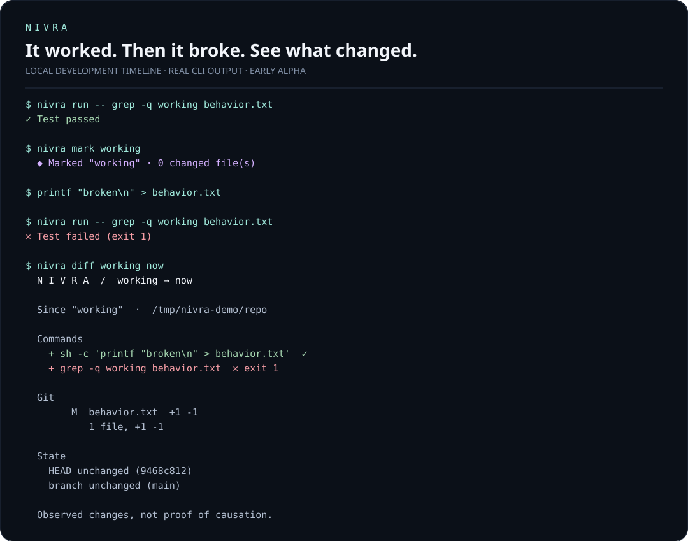

<div align="center">

# Nivra

**It worked twenty minutes ago. What changed?**

A local development timeline that connects commands to Git state.

[](https://github.com/bilalyazicioglu/nivra/actions/workflows/ci.yml)
[](LICENSE)
[](docs/PLAN.md)

[Get started](#get-started) · [How it works](#how-it-works) · [Documentation](docs/wiki/Home.md) · [Contribute](CONTRIBUTING.md)

</div>



Your shell remembers a command. Git remembers a commit. Nivra connects the moments in between: the test that passed, the edit, and the test that failed.

**Early alpha, built from source.** The CLI workflow below is implemented. Interactive TUI, ports, export, sync, installers, and automatic retention are roadmap items. Previously codenamed Rewind.

## Get started

Requires a current stable Rust toolchain and Git. The initial target is macOS + zsh; CI also exercises the core CLI on Linux. No published package or release binary yet.

```sh
git clone https://github.com/bilalyazicioglu/nivra.git
cd nivra
cargo build --locked
sh scripts/demo.sh
```

The demo creates an isolated temporary repository and database, runs a real passing check, changes a file, runs the failing check, and compares the two moments. It cleans up after itself.

To install the CLI locally:

```sh
cargo install --path . --locked
```

In **your own Git repository**:

```sh
nivra run -- npm test
nivra mark working

# Make an edit, then run your test again.
nivra run -- npm test
nivra diff working now
```

`nivra run` executes the command and returns its exit code. It inherits your terminal; Nivra does not save the command's output. Shell expressions require an explicit shell: `nivra run -- sh -c 'your command'`.

### Automatic recording in zsh

Opt in for the current shell:

```zsh
eval "$(nivra init zsh)"
```

Add that line to your `.zshrc` only after trying it. Nivra never edits shell configuration automatically. Commands beginning with a space are skipped. `nivra` management commands are skipped by the integration.

```sh
nivra                  # recent events
nivra events --json    # structured events, including both snapshots
nivra mark working    # save or replace a mark in this repository
nivra diff working    # compare with now
nivra pause           # global across shells
nivra resume
nivra ignore-next     # next eligible capture across shells
nivra status
nivra doctor
```

## How it works

```text
        before                 event                  after
   branch · HEAD         command · exit code      branch · HEAD
   changed files    ──►  directory · timing   ──►  changed files
   fingerprints                                   fingerprints
                              │
                       local SQLite
                              │
                  working ─────────── now
```

Each recorded event has a before snapshot and, when capture completes, an after snapshot. Named marks let you compare moments without memorizing event IDs. Fingerprints detect further edits to files that were already dirty. Marks are scoped to the repository root.

Nivra reports **observed changes**, never proof that a particular command caused a bug. Hooks observe command boundaries; editor changes outside those boundaries are visible at the next snapshot or mark. Concurrent shells can overlap.

## Privacy and limitations

- No accounts, telemetry, network capture, saved stdout/stderr, environment dump or stored source contents.
- Command text, absolute paths, branch names, changed filenames and content hashes are stored locally. These are sensitive metadata.
- Commands matching common credential patterns are replaced in full before persistence. Redaction is heuristic; use `nivra pause` for sensitive work. See [privacy](docs/wiki/Privacy.md).
- SQLite lives at `$NIVRA_DATA_DIR/nivra.db`, otherwise `$XDG_DATA_HOME/nivra/nivra.db`, otherwise `~/.local/share/nivra/nivra.db`. Nivra makes its data directory owner-only on Unix; use a dedicated directory.
- Hooks are synchronous. Each Git subprocess has a 750 ms deadline; this is not a total hook latency guarantee. Large repositories need benchmarking before everyday adoption.
- File fingerprints cover regular changed files up to 8 MiB. Unsupported paths/files produce incomplete-snapshot notices. Ignored files and submodule contents are excluded.
- A changed HEAD is displayed, but committed file differences are not expanded yet. No historical source recovery or line-by-line diff is promised.
- Interrupted commands can remain incomplete. Automatic retention, session browsing, shell-installation detection and full diff stats are not implemented.

## Contributing

Start with [CONTRIBUTING.md](CONTRIBUTING.md), the [milestone plan](docs/PLAN.md), and the [architecture](docs/wiki/Architecture.md). Small, tested changes that improve the debugging workflow are welcome.

```sh
cargo fmt --all -- --check
cargo clippy --all-targets --locked -- -D warnings
cargo test --locked
```

[Report a bug](https://github.com/bilalyazicioglu/nivra/issues/new?template=bug_report.yml) · [Propose a feature](https://github.com/bilalyazicioglu/nivra/issues/new?template=feature_request.yml) · [Security policy](SECURITY.md)

## License

[MIT](LICENSE) © Nivra contributors.
