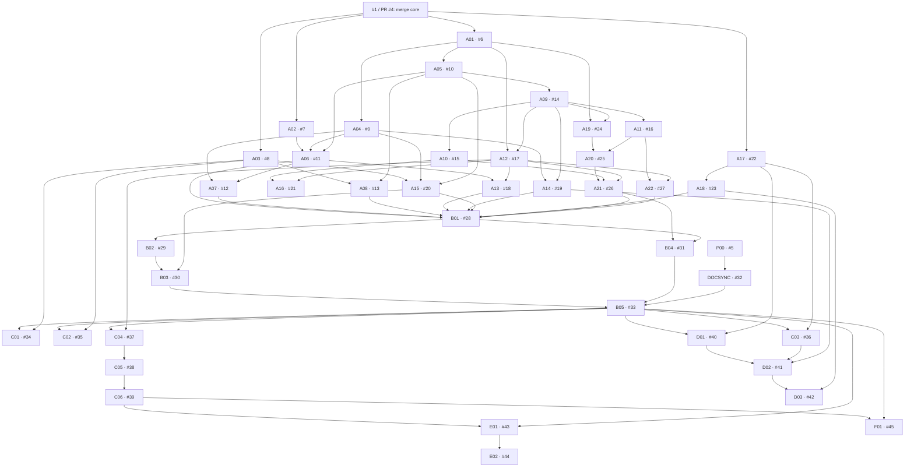

# Nivra execution plan

Planning snapshot: 2026-09-26. The old Rewind document is product input; the implementation and roadmap use **Nivra**. No star count or launch date is promised.

## Current state
- Core implementation merged through [PR #4](https://github.com/bilalyazicioglu/nivra/pull/4) as commit `419397b0422354f27bb0eab0a1d1e25086fc5511`. macOS and Ubuntu CI passed; [#1](https://github.com/bilalyazicioglu/nivra/issues/1) is complete.
- [#2](https://github.com/bilalyazicioglu/nivra/issues/2) tracks M1 and [#3](https://github.com/bilalyazicioglu/nivra/issues/3) tracks M2.
- This plan and initial wiki publication are tracked by [#5](https://github.com/bilalyazicioglu/nivra/issues/5) and [PR #46](https://github.com/bilalyazicioglu/nivra/pull/46).
- 41 new work items cover known work. Future design-gated work packages are recorded without pretending they are ready for cheap-agent implementation.

## Product contract
Answer “what changed between working and broken?” using local, inspectable development-state observations. Keep the shell working when capture fails. No required account, server, telemetry, AI, terminal-output recording or environment dump. Redact before persistence. Never infer causality or execute stored commands implicitly.

## Execution order
1. **Foundation gate:** core PR #4 is merged; review and accept planning PR #46 before activating M1 tasks.
2. **Parallel discovery:** [#6](https://github.com/bilalyazicioglu/nivra/issues/6), [#7](https://github.com/bilalyazicioglu/nivra/issues/7), [#8](https://github.com/bilalyazicioglu/nivra/issues/8), [#22](https://github.com/bilalyazicioglu/nivra/issues/22) establish shared contracts, benchmarks, shell regression evidence and current port inspection. Parallelize only with disjoint ownership.
3. **Shared foundations:** [#9](https://github.com/bilalyazicioglu/nivra/issues/9), [#10](https://github.com/bilalyazicioglu/nivra/issues/10), [#14](https://github.com/bilalyazicioglu/nivra/issues/14), [#17](https://github.com/bilalyazicioglu/nivra/issues/17) land configuration, safe migrations, read queries and comparison contracts. Serialize conflicting edits to main/store/model.
4. **Usable experience and reliability:** follow each task dependency for capture limits, privacy, timing, retention, CLI inspection/search and TUI. The visual path is [#24](https://github.com/bilalyazicioglu/nivra/issues/24) → [#25](https://github.com/bilalyazicioglu/nivra/issues/25) → [#26](https://github.com/bilalyazicioglu/nivra/issues/26). Do not trade shell/privacy reliability for screenshots.
5. **Evidence before launch:** [#28](https://github.com/bilalyazicioglu/nivra/issues/28) → [#29](https://github.com/bilalyazicioglu/nivra/issues/29) → [#30](https://github.com/bilalyazicioglu/nivra/issues/30) → [#33](https://github.com/bilalyazicioglu/nivra/issues/33) covers seven real days, artifacts, clean installs and the maintainer gate. [#31](https://github.com/bilalyazicioglu/nivra/issues/31) supplies the real demo; [#32](https://github.com/bilalyazicioglu/nivra/issues/32) keeps wiki publication reviewable.
6. **Activate later milestones deliberately:** M3–M6 remain deferred until their predecessor gates and design decisions are accepted. Size-L packages must be split into S/M child issues first.

## First assignments for lower-cost agents
After planning PR #46 merges, start with [#7](https://github.com/bilalyazicioglu/nivra/issues/7) (benchmark harness) and [#8](https://github.com/bilalyazicioglu/nivra/issues/8) (PTY regression tests). These can use separate files and synthetic fixtures. [#15](https://github.com/bilalyazicioglu/nivra/issues/15) (show/marks) follows the accepted read API; [#21](https://github.com/bilalyazicioglu/nivra/issues/21) (terminal rendering) follows inspection and comparison. Documentation publication tooling is [#32](https://github.com/bilalyazicioglu/nivra/issues/32) after the planning source is accepted.

Use [AGENT_WORKFLOW.md](AGENT_WORKFLOW.md) for routing, the copyable prompt, ownership and the definition of done. `agent: small` is an eligibility hint, not a budget guarantee. No coding agent can replace seven elapsed days, a maintainer decision or independent security review.

## Dependency graph

The graph is checked for missing keys and cycles by `python3 scripts/check-plan.py`. Edges mean accepted/merged prerequisites, not simply closed issue numbers.

## M0 — Core proof and planning

| Issue | Work | Agent / size | Priority | Dependencies |
| --- | --- | --- | --- | --- |
| [#5](https://github.com/bilalyazicioglu/nivra/issues/5) · P00 | Publish an agent-ready roadmap and the initialized wiki | small / S | P0 | None |

Gate: core code reviewed/merged, reproducible demo verified, planning source accepted and initial wiki publication verified.

## M1 — Daily-use alpha

| Issue | Work | Agent / size | Priority | Dependencies |
| --- | --- | --- | --- | --- |
| [#6](https://github.com/bilalyazicioglu/nivra/issues/6) · A01 | Define snapshot, query and comparison contracts before parallel implementation | specialist / M | P0 | [#1 / core PR #4](https://github.com/bilalyazicioglu/nivra/pull/4) |
| [#7](https://github.com/bilalyazicioglu/nivra/issues/7) · A02 | Add reproducible release-binary capture benchmarks | small / S | P0 | [#1 / core PR #4](https://github.com/bilalyazicioglu/nivra/pull/4) |
| [#8](https://github.com/bilalyazicioglu/nivra/issues/8) · A03 | Expand interactive zsh regression coverage | small / S | P0 | [#1 / core PR #4](https://github.com/bilalyazicioglu/nivra/pull/4) |
| [#9](https://github.com/bilalyazicioglu/nivra/issues/9) · A04 | Implement validated local configuration loading | standard / M | P1 | [#6](https://github.com/bilalyazicioglu/nivra/issues/6) |
| [#10](https://github.com/bilalyazicioglu/nivra/issues/10) · A05 | Harden SQLite migrations, concurrent initialization and private storage | specialist / M | P0 | [#6](https://github.com/bilalyazicioglu/nivra/issues/6) |
| [#11](https://github.com/bilalyazicioglu/nivra/issues/11) · A06 | Enforce a total capture budget with explicit partial snapshots | specialist / M | P0 | [#7](https://github.com/bilalyazicioglu/nivra/issues/7), [#9](https://github.com/bilalyazicioglu/nivra/issues/9), [#10](https://github.com/bilalyazicioglu/nivra/issues/10) |
| [#12](https://github.com/bilalyazicioglu/nivra/issues/12) · A07 | Add configurable exclusions and strengthen pre-storage redaction | specialist / M | P0 | [#9](https://github.com/bilalyazicioglu/nivra/issues/9), [#11](https://github.com/bilalyazicioglu/nivra/issues/11) |
| [#13](https://github.com/bilalyazicioglu/nivra/issues/13) · A08 | Separate command elapsed time from wall-clock event timestamps | standard / M | P1 | [#8](https://github.com/bilalyazicioglu/nivra/issues/8), [#10](https://github.com/bilalyazicioglu/nivra/issues/10) |
| [#14](https://github.com/bilalyazicioglu/nivra/issues/14) · A09 | Extract a paginated read API for events, sessions and marks | standard / M | P0 | [#10](https://github.com/bilalyazicioglu/nivra/issues/10) |
| [#15](https://github.com/bilalyazicioglu/nivra/issues/15) · A10 | Add event inspection and named-mark listing commands | small / S | P1 | [#14](https://github.com/bilalyazicioglu/nivra/issues/14) |
| [#16](https://github.com/bilalyazicioglu/nivra/issues/16) · A11 | Add session browsing and composable timeline search | standard / M | P1 | [#14](https://github.com/bilalyazicioglu/nivra/issues/14) |
| [#17](https://github.com/bilalyazicioglu/nivra/issues/17) · A12 | Implement structured state comparison shared by CLI and TUI | specialist / M | P0 | [#6](https://github.com/bilalyazicioglu/nivra/issues/6), [#14](https://github.com/bilalyazicioglu/nivra/issues/14) |
| [#18](https://github.com/bilalyazicioglu/nivra/issues/18) · A13 | Expand comparisons to staged and committed Git changes | specialist / M | P1 | [#11](https://github.com/bilalyazicioglu/nivra/issues/11), [#17](https://github.com/bilalyazicioglu/nivra/issues/17) |
| [#19](https://github.com/bilalyazicioglu/nivra/issues/19) · A14 | Implement explicit retention and safe garbage collection | specialist / M | P1 | [#9](https://github.com/bilalyazicioglu/nivra/issues/9), [#14](https://github.com/bilalyazicioglu/nivra/issues/14) |
| [#20](https://github.com/bilalyazicioglu/nivra/issues/20) · A15 | Improve doctor and installation troubleshooting | small / S | P1 | [#8](https://github.com/bilalyazicioglu/nivra/issues/8), [#9](https://github.com/bilalyazicioglu/nivra/issues/9), [#10](https://github.com/bilalyazicioglu/nivra/issues/10) |
| [#21](https://github.com/bilalyazicioglu/nivra/issues/21) · A16 | Polish terminal output for narrow widths and accessibility | small / S | P2 | [#15](https://github.com/bilalyazicioglu/nivra/issues/15), [#17](https://github.com/bilalyazicioglu/nivra/issues/17) |
| [#22](https://github.com/bilalyazicioglu/nivra/issues/22) · A17 | Implement read-only current port inspection on macOS | standard / M | P1 | [#1 / core PR #4](https://github.com/bilalyazicioglu/nivra/pull/4) |
| [#23](https://github.com/bilalyazicioglu/nivra/issues/23) · A18 | Add safe, explicit port-owner termination | specialist / M | P2 | [#22](https://github.com/bilalyazicioglu/nivra/issues/22) |
| [#24](https://github.com/bilalyazicioglu/nivra/issues/24) · A19 | Build the TUI terminal lifecycle and application shell | standard / M | P1 | [#6](https://github.com/bilalyazicioglu/nivra/issues/6), [#14](https://github.com/bilalyazicioglu/nivra/issues/14) |
| [#25](https://github.com/bilalyazicioglu/nivra/issues/25) · A20 | Implement keyboard-driven timeline browsing in the TUI | standard / M | P1 | [#24](https://github.com/bilalyazicioglu/nivra/issues/24), [#16](https://github.com/bilalyazicioglu/nivra/issues/16) |
| [#26](https://github.com/bilalyazicioglu/nivra/issues/26) · A21 | Add event details and baseline comparison panels to the TUI | standard / M | P1 | [#25](https://github.com/bilalyazicioglu/nivra/issues/25), [#15](https://github.com/bilalyazicioglu/nivra/issues/15), [#17](https://github.com/bilalyazicioglu/nivra/issues/17) |
| [#27](https://github.com/bilalyazicioglu/nivra/issues/27) · A22 | Add a deterministic why command for repeated success/failure checks | standard / M | P2 | [#16](https://github.com/bilalyazicioglu/nivra/issues/16), [#17](https://github.com/bilalyazicioglu/nivra/issues/17) |

Gate: all M1 acceptance criteria demonstrated, shared interfaces documented, tests/benchmarks available and no unresolved release-blocking capture/privacy failures.

## M2 — Public preview

| Issue | Work | Agent / size | Priority | Dependencies |
| --- | --- | --- | --- | --- |
| [#28](https://github.com/bilalyazicioglu/nivra/issues/28) · B01 | Complete a documented daily-use alpha evaluation | specialist / M | P0 | [#11](https://github.com/bilalyazicioglu/nivra/issues/11), [#12](https://github.com/bilalyazicioglu/nivra/issues/12), [#13](https://github.com/bilalyazicioglu/nivra/issues/13), [#18](https://github.com/bilalyazicioglu/nivra/issues/18), [#19](https://github.com/bilalyazicioglu/nivra/issues/19), [#20](https://github.com/bilalyazicioglu/nivra/issues/20), [#23](https://github.com/bilalyazicioglu/nivra/issues/23), [#26](https://github.com/bilalyazicioglu/nivra/issues/26), [#27](https://github.com/bilalyazicioglu/nivra/issues/27) |
| [#29](https://github.com/bilalyazicioglu/nivra/issues/29) · B02 | Build reproducible preview release artifacts and checksums | standard / M | P1 | [#28](https://github.com/bilalyazicioglu/nivra/issues/28) |
| [#30](https://github.com/bilalyazicioglu/nivra/issues/30) · B03 | Verify clean-machine install, upgrade and uninstall flows | small / S | P1 | [#29](https://github.com/bilalyazicioglu/nivra/issues/29), [#20](https://github.com/bilalyazicioglu/nivra/issues/20) |
| [#31](https://github.com/bilalyazicioglu/nivra/issues/31) · B04 | Produce the real demo recording and public-preview materials | small / S | P1 | [#26](https://github.com/bilalyazicioglu/nivra/issues/26), [#28](https://github.com/bilalyazicioglu/nivra/issues/28) |
| [#33](https://github.com/bilalyazicioglu/nivra/issues/33) · B05 | Run the public-preview release gate | specialist / S | P0 | [#30](https://github.com/bilalyazicioglu/nivra/issues/30), [#31](https://github.com/bilalyazicioglu/nivra/issues/31), [#32](https://github.com/bilalyazicioglu/nivra/issues/32) |
| [#32](https://github.com/bilalyazicioglu/nivra/issues/32) · DOCSYNC | Add a checked, manual wiki publication workflow | small / S | P2 | [#5](https://github.com/bilalyazicioglu/nivra/issues/5) |

Gate: seven real days of evidence, clean-machine installation, artifact integrity, truthful demo/wiki and an explicit maintainer go/no-go. Public release/posting is a separate authorized action.

## M3 — Portability and bundles

| Issue | Work | Agent / size | Priority | Dependencies |
| --- | --- | --- | --- | --- |
| [#34](https://github.com/bilalyazicioglu/nivra/issues/34) · C01 | Add Bash integration using the accepted capture contract | standard / M | P2 | [#33](https://github.com/bilalyazicioglu/nivra/issues/33), [#8](https://github.com/bilalyazicioglu/nivra/issues/8) |
| [#35](https://github.com/bilalyazicioglu/nivra/issues/35) · C02 | Add Fish integration using the accepted capture contract | standard / M | P2 | [#33](https://github.com/bilalyazicioglu/nivra/issues/33), [#8](https://github.com/bilalyazicioglu/nivra/issues/8) |
| [#36](https://github.com/bilalyazicioglu/nivra/issues/36) · C03 | Add a Linux port provider and publish a tested support matrix | standard / M | P2 | [#33](https://github.com/bilalyazicioglu/nivra/issues/33), [#22](https://github.com/bilalyazicioglu/nivra/issues/22) |
| [#37](https://github.com/bilalyazicioglu/nivra/issues/37) · C04 | Specify a versioned portable session bundle and import threat model | specialist / M | P2 | [#33](https://github.com/bilalyazicioglu/nivra/issues/33), [#17](https://github.com/bilalyazicioglu/nivra/issues/17) |
| [#38](https://github.com/bilalyazicioglu/nivra/issues/38) · C05 | Implement local bundle export with explicit privacy preview | standard / M | P2 | [#37](https://github.com/bilalyazicioglu/nivra/issues/37) |
| [#39](https://github.com/bilalyazicioglu/nivra/issues/39) · C06 | Implement safe, read-only inspection of imported bundles | specialist / M | P2 | [#38](https://github.com/bilalyazicioglu/nivra/issues/38) |

Deferred: no implementation until dependencies and design acceptance are verified. These are roadmap directions, not release promises.

## M4 — Runtime timeline

| Issue | Work | Agent / size | Priority | Dependencies |
| --- | --- | --- | --- | --- |
| [#40](https://github.com/bilalyazicioglu/nivra/issues/40) · D01 | Design runtime observation, ownership and resource budgets | specialist / M | P2 | [#33](https://github.com/bilalyazicioglu/nivra/issues/33), [#22](https://github.com/bilalyazicioglu/nivra/issues/22) |
| [#41](https://github.com/bilalyazicioglu/nivra/issues/41) · D02 | Implement a bounded runtime timeline pilot | specialist / L | P2 | [#40](https://github.com/bilalyazicioglu/nivra/issues/40), [#36](https://github.com/bilalyazicioglu/nivra/issues/36), [#19](https://github.com/bilalyazicioglu/nivra/issues/19) |
| [#42](https://github.com/bilalyazicioglu/nivra/issues/42) · D03 | Design and implement explicit, race-safe process restart | specialist / M | P2 | [#41](https://github.com/bilalyazicioglu/nivra/issues/41), [#23](https://github.com/bilalyazicioglu/nivra/issues/23) |

Deferred: no implementation until dependencies and design acceptance are verified. These are roadmap directions, not release promises.

## M5 — Optional encrypted sync

| Issue | Work | Agent / size | Priority | Dependencies |
| --- | --- | --- | --- | --- |
| [#43](https://github.com/bilalyazicioglu/nivra/issues/43) · E01 | Decide optional encrypted sync architecture and threat model | specialist / M | P2 | [#39](https://github.com/bilalyazicioglu/nivra/issues/39), [#33](https://github.com/bilalyazicioglu/nivra/issues/33) |
| [#44](https://github.com/bilalyazicioglu/nivra/issues/44) · E02 | Implement the approved optional sync client and self-hosted server | specialist / L | P2 | [#43](https://github.com/bilalyazicioglu/nivra/issues/43) |

Deferred: no implementation until dependencies and design acceptance are verified. These are roadmap directions, not release promises.

## M6 — Reviewed sharing

| Issue | Work | Agent / size | Priority | Dependencies |
| --- | --- | --- | --- | --- |
| [#45](https://github.com/bilalyazicioglu/nivra/issues/45) · F01 | Design sanitized share previews and a read-only session viewer | specialist / M | P2 | [#39](https://github.com/bilalyazicioglu/nivra/issues/39), [#33](https://github.com/bilalyazicioglu/nivra/issues/33) |

Deferred: no implementation until dependencies and design acceptance are verified. These are roadmap directions, not release promises.

## Scope boundaries and maintenance

Not currently committed: a terminal emulator, an AI assistant, automatic stdout/stderr capture, a full system monitor, automatic source restoration, or a mandatory cloud service. Full patch storage would require its own reviewed privacy/storage design before it becomes planned work.

GitHub issues own live status; [BACKLOG.json](BACKLOG.json) stores stable keys, issue URLs, initial routing and dependencies. Initial status is a snapshot, not a claim of current readiness. Maintainers update direct dependents after merges and update both issue and manifest when scope changes.

Keep one focused issue per implementation PR. Do not implement the broad #2/#3 trackers or size-L future packages as one agent task. Existing plans are evolved through reviewed changes; no fabricated tasks, users or activity are needed to look professional.
